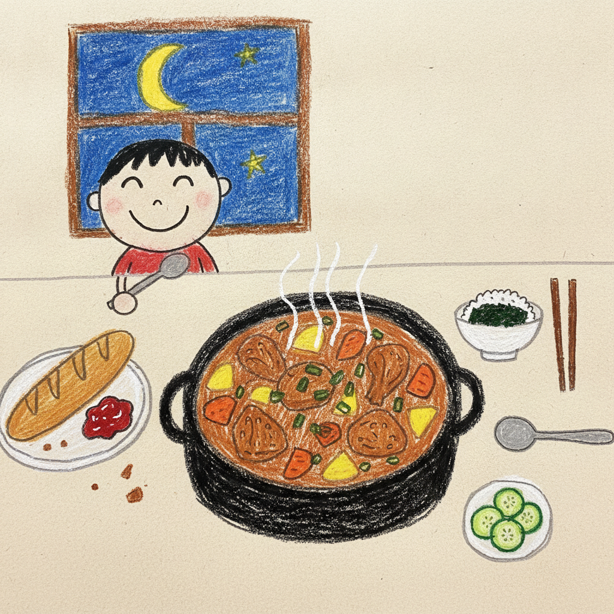

# 2026년 8월 22일 (토)

## 날씨

맑았다가 오후에 잠깐 흐려졌다. 여름 끝자락이라 그런지 한낮에는 여전히 덥지만,
해가 지고 나니 바람이 제법 선선해졌다. 매미 소리도 며칠 전보다 줄어든 것 같다.

## 오늘 있었던 일

아침에 늦잠을 자서 열 시가 다 되어 일어났다. 방학이 얼마 남지 않았는데
아직도 늦게 일어나는 버릇을 못 고쳤다.

아침 겸 점심으로 바게트 빵을 먹었다. 겉은 딱딱한데 안은 부드러워서
씹을수록 고소한 맛이 났다. 처음에는 그냥 뜯어 먹다가, 나중에는 잼을 발라 먹었더니
훨씬 맛있었다. 빵 부스러기가 자꾸 떨어져서 식탁을 두 번이나 닦아야 했다.

오후에는 밀린 방학 숙제를 정리했다. 생각보다 남은 게 많아서 조금 놀랐다.
그래도 하나씩 지워 나가니 마음이 가벼워졌다.

저녁에는 간장 닭볶음을 만들어 먹었다. 닭다리살을 볶다가 간장이랑 맛술을 넣고
감자와 당근을 넣어 푹 익혔다. 뚜껑을 열 때마다 올라오는 김이 뜨거워서
얼굴을 뒤로 뺐다. 마지막에 올리고당을 넣으니까 국물이 반짝반짝 윤이 났다.
감자가 국물을 잔뜩 머금어서 제일 맛있었다. 밥을 한 그릇 더 먹었다.

## 오늘 먹은 것

- 아침 겸 점심: 바게트 빵 (잼을 발라서)
- 저녁: 간장 닭볶음, 흰쌀밥, 김, 오이무침 ([레시피](저녁_레시피.md))

## 기억하고 싶은 것

간장 닭볶음의 감자 맛. 아무 맛도 없던 감자가 국물을 빨아들이니까
닭고기보다 더 맛있어졌다는 게 신기했다.
요리는 재료를 넣는 것보다 기다리는 시간이 더 중요한 것 같다.

## 내일 할 일

- [ ] 남은 방학 숙제 마무리하기
- [ ] 일찍 일어나기 (아침 8시)
- [ ] 읽던 책 마저 읽기
