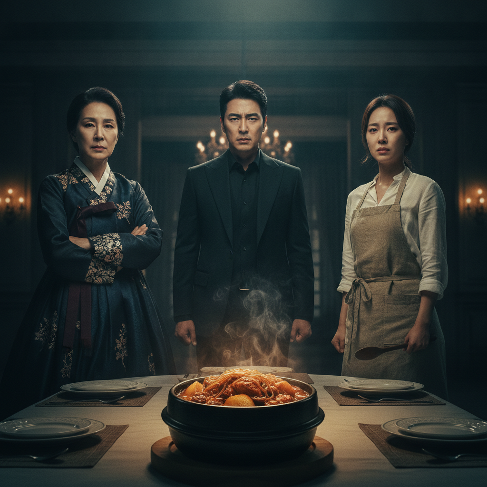
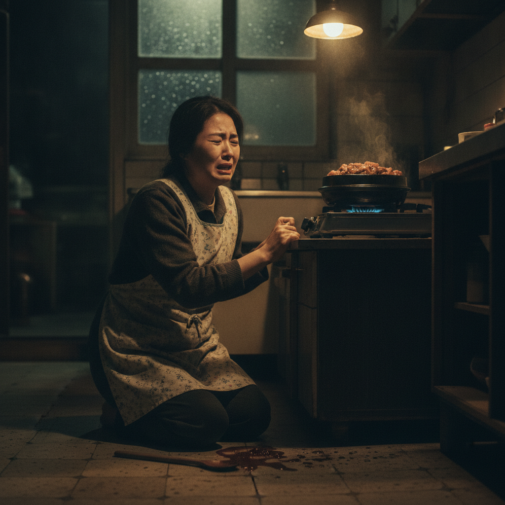
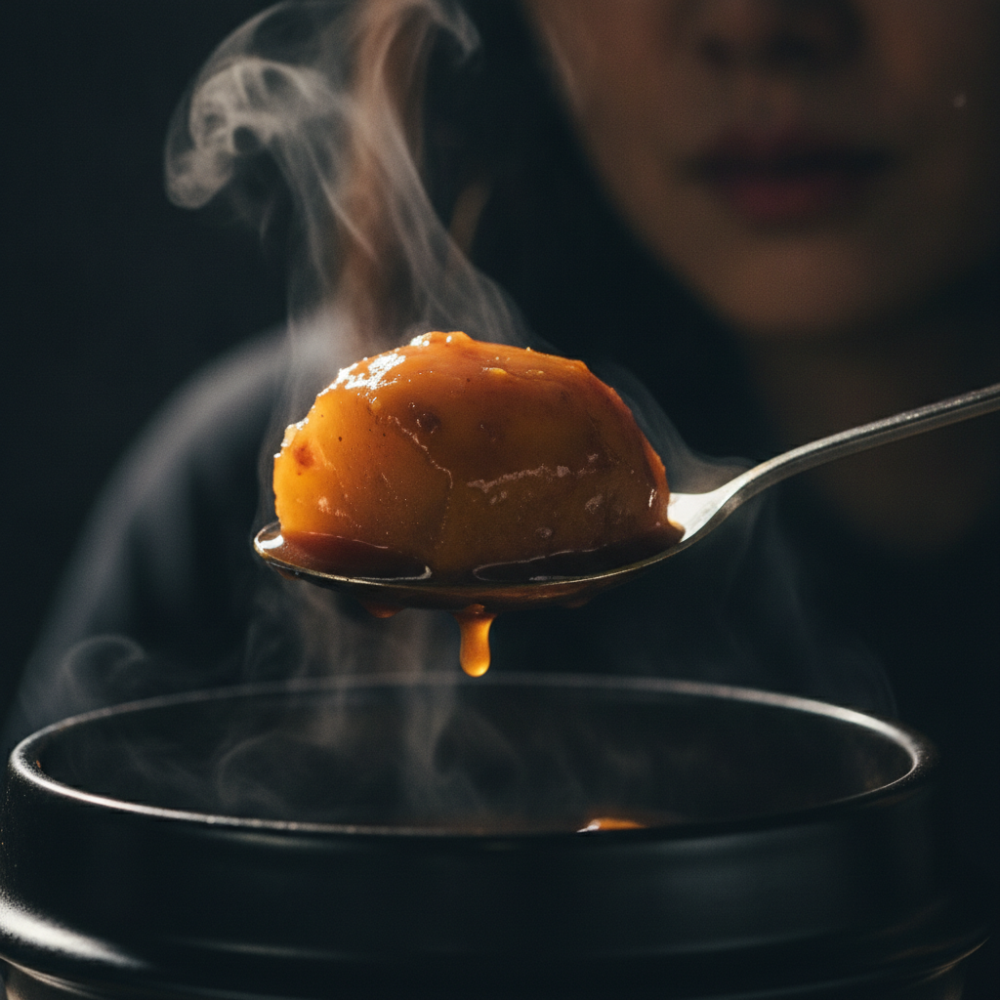

# 감자의 눈물

> **일일 아침드라마 · 전 120부작**
> 원작: [오늘일기.md](오늘일기.md) (2026년 8월 22일 토요일)

---

## 기획 의도

한 그릇의 간장 닭볶음이 3대에 걸친 재벌가의 비밀을 뒤집는다.
감자는 아무 맛도 없다. 그러나 국물을 머금는 순간, 감자는 모든 것을 알게 된다.
우리는 묻는다. **당신은 오늘, 무엇을 머금었는가?**

## 등장인물

| 인물 | 나이 | 소개 |
|---|---|---|
| **최말순** | 68 | 태정그룹 회장. 40년 전 자신이 버린 레시피가 돌아올 줄 몰랐다. |
| **서다혜** | 34 | 태정가의 며느리이자 요리사. 늦잠을 자는 버릇이 있다. 그 버릇이 그녀를 살렸다. |
| **강태오** | 36 | 최말순의 아들. 아내와 어머니 사이에서 40부 동안 아무것도 하지 않는다. |
| **서다인** | 34 | 다혜의 쌍둥이 언니. 죽은 줄 알았다. 죽지 않았다. |

---

## 1화 — 「열 시에 눈을 뜨다」

> *원작: "아침에 늦잠을 자서 열 시가 다 되어 일어났다."*

다혜가 눈을 뜬다. 벽시계는 **열 시**를 가리키고 있다.

**다혜** 　(벌떡 일어나며) 열 시…? 내가… 왜 여기 있지?

3년간의 기억이 없다. 침대 옆 협탁에는 처음 보는 결혼반지가 놓여 있다.

**태오** 　(문을 열며) 일어났어? …여보.
**다혜** 　여보? 누구세요, 당신.

문틈으로 그 광경을 지켜보던 최말순의 입꼬리가 서늘하게 올라간다.

**최말순** 　(혼잣말) 그래… 기억을 못 하는구나. 잘됐어.
　　　　　　저 계집이 그날 부엌에서 본 것만 잊는다면, 이 집은 무사해.

---

## 2화 — 「바게트」

> *원작: "아침 겸 점심으로 바게트 빵을 먹었다. (…) 잼을 발라 먹었더니 훨씬 맛있었다."*

아침 식탁. 다혜가 바게트에 딸기잼을 바르고 있다.

**최말순** 　(잼 병을 낚아채며) 이 집에서 그 잼은 아무나 바르는 게 아니다.
**다혜** 　…그냥 딸기잼이잖아요, 어머니.
**최말순** 　(바게트를 집어 들며) 딸기잼? 이게 딸기잼으로 보이니!

**— 바게트 싸대기 —**

은쟁반이 뒤집히고, 딸기잼이 흰 식탁보 위로 붉게 번진다.
커피잔이 쓰러지고, 빵 부스러기가 사방으로 흩어진다.

**최말순** 　(가쁜 숨) 치워. 지금 당장.
**다혜** 　(무릎을 꿇고 부스러기를 쓸며) …네.

> *원작: "빵 부스러기가 자꾸 떨어져서 식탁을 두 번이나 닦아야 했다."*

다혜는 식탁을 **두 번** 닦는다.
한 번은 잼을 지우기 위해. 그리고 한 번은 — **그 밑에 있던 것을 지우기 위해.**

식탁보 아래, 40년 전 날짜가 적힌 종이 한 장이 그녀의 손끝에 걸린다.

---

## 3화 — 「밀린 것들」

> *원작: "오후에는 밀린 방학 숙제를 정리했다. 생각보다 남은 게 많아서 조금 놀랐다."*

다혜가 서재 금고를 연다. 밀린 서류가 쏟아진다.
생각보다 남은 게 많았다.

- 태정그룹 비자금 장부 (1986~2026)
- 친자 확인서 **3장**
- 사망신고서 1장 — **이름: 서다인**
- 그리고 손으로 쓴 레시피 한 장. 제목은 「간장 닭볶음」.

**다혜** 　(떨리는 손으로) 이 글씨… 우리 엄마 글씨야.
　　　　어머니가… 왜 우리 엄마 레시피를 금고에 넣어놨지?

그 순간, 등 뒤에서 목소리가 들린다.

**???**　이제야 찾았네. 늦잠꾸러기.
**다혜** 　(돌아보며) …누구세요.

거울처럼 똑같이 생긴 여자가 서 있다.

**서다인** 　나? 네가 3년 전에 죽인 사람.

> *원작: "그래도 하나씩 지워 나가니 마음이 가벼워졌다."*
> 다혜는 하나씩 지워 나갔다. 마음은 가벼워지지 않았다.

---

## 4화 — 「끓어 넘치다」

> *원작: "뚜껑을 열 때마다 올라오는 김이 뜨거워서 얼굴을 뒤로 뺐다."*

비 오는 밤. 다혜가 어머니의 레시피대로 간장 닭볶음을 끓인다.
간장 4큰술, 맛술 2큰술, 설탕 1큰술.

뚜껑을 연다. 김이 얼굴로 확 끼친다.
다혜는 얼굴을 뒤로 뺀다. **뜨거워서가 아니었다.**

**다혜** 　(주저앉으며) 엄마… 이 냄새… 나 알아. 나 이 냄새 알아…

냄비가 끓어 넘친다. 국물이 검게 흘러내린다.
나무 주걱이 바닥에 떨어진다.

**최말순** 　(부엌 문 앞에서) 40년 전에도 똑같이 넘쳤지.
　　　　　　네 어미가 이 부엌에서 그 냄비를 끓이던 날에.
**다혜** 　…그날 무슨 일이 있었어요.
**최말순** 　(등을 돌리며) 감자가 다 익거든, 그때 다시 물어라.

---

## 최종화 — 「감자」

> *원작: "감자가 국물을 잔뜩 머금어서 제일 맛있었다."*

식탁. 네 사람이 앉아 있다. 아무도 말하지 않는다.
다혜가 숟가락을 들어 감자 한 조각을 건진다.

**다혜** 　어머니. 감자는요.
　　　　처음엔 아무 맛도 없어요. 그냥 하얗고, 딱딱하고, 심심하죠.
　　　　근데 국물 속에 오래 두면요 —

　　　　*(감자에서 국물 한 방울이 떨어진다)*

　　　　**닭보다 맛있어져요.**

**최말순** 　(손이 떨린다) …그만해라.
**다혜** 　저도 그랬어요. 이 집에서 3년을 끓었거든요.
　　　　이제 저는, 어머니가 뭘 넣으셨는지 다 알아요.

숟가락이 접시에 놓인다. 딱, 하는 소리.

**다혜** 　(자리에서 일어서며) **밥 한 그릇 더 주세요.**
　　　　오늘은 다 먹고 갈 거예요.

> *원작: "밥을 한 그릇 더 먹었다."*

*— 끝 —*

---

## 명대사 모음

> **"딸기잼? 이게 딸기잼으로 보이니!"** — 최말순 (2화)

> **"나? 네가 3년 전에 죽인 사람."** — 서다인 (3화)

> **"감자가 다 익거든, 그때 다시 물어라."** — 최말순 (4화)

> **"요리는 재료를 넣는 것보다, 기다리는 시간이 더 중요하더라구요."** — 다혜 (최종화)

## 시즌 2 예고

> *원작 「내일 할 일」에서:*
>
> - [ ] 남은 방학 숙제 마무리하기 → **남은 장부를 마저 태운다**
> - [ ] 일찍 일어나기 (아침 8시) → **이제 다혜는 최말순보다 먼저 일어난다**
> - [ ] 읽던 책 마저 읽기 → **그 책 속에 마지막 유언장이 끼워져 있다**

---

*본 작품은 [오늘일기.md](오늘일기.md)를 각색한 허구입니다.
등장인물, 단체, 사건은 모두 실제와 관련이 없습니다.
사진은 Gemini 2.5 Flash Image(나노바나나)로 생성한 가상의 이미지입니다.*
