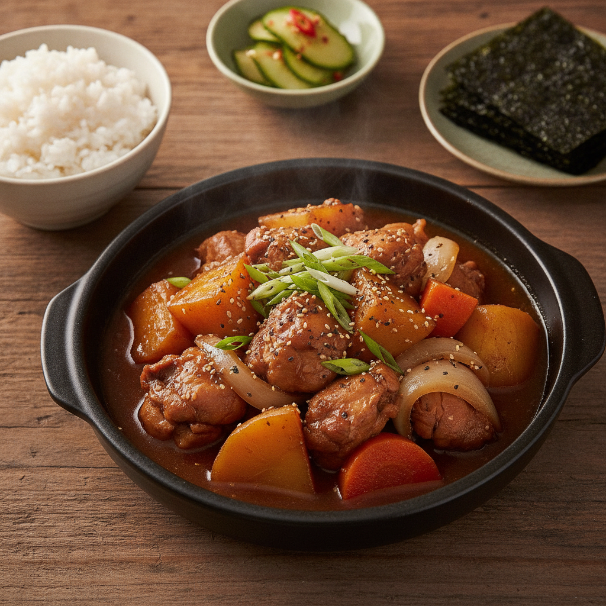

# 오늘 저녁 레시피: 간장 닭볶음

이미지: Gemini 2.5 Flash Image(나노바나나)로 생성

## 조리 시간

약 35분

## 재료 (2인분)

- 닭다리살 500g
- 감자 2개
- 양파 1/2개
- 당근 1/2개
- 대파 1/2대
- 식용유 1큰술
- 물 300mL

## 양념

- 진간장 4큰술
- 맛술 2큰술
- 설탕 1큰술
- 다진 마늘 1큰술
- 올리고당 1큰술
- 후춧가루 약간

## 만드는 방법

1. 닭다리살은 한입 크기로 자르고, 감자와 당근은 큼직하게 썬다.
2. 팬에 식용유를 두르고 닭을 중불에서 5분 정도 볶는다.
3. 물과 간장, 맛술, 설탕, 다진 마늘을 넣고 끓인다.
4. 감자와 당근을 넣고 뚜껑을 덮어 중약불에서 15분간 익힌다.
5. 양파와 대파를 넣고 5분 더 끓인다.
6. 올리고당과 후춧가루를 넣어 간을 맞추고 불을 끈다.

## 곁들이면 좋은 음식

따뜻한 밥과 김, 오이무침을 함께 준비하면 잘 어울립니다.
