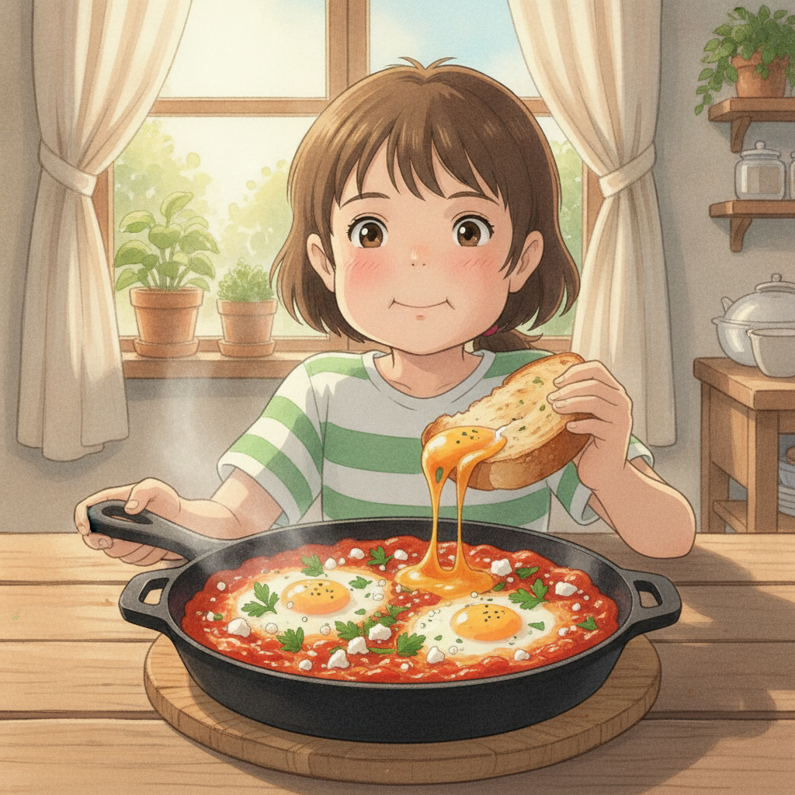

# 샥슈카 (15분 브런치 레시피)

토마토 소스가 끓는 동안 빵만 구우면 15분에 끝나는 한 팬 브런치. 반숙 노른자를 터뜨려 빵으로 싹싹 닦아 먹는 게 핵심입니다.

- **조리 시간**: 15분
- **분량**: 2인분
- **난이도**: ⭐☆☆ (쉬움)

## 재료

| 재료 | 분량 |
|------|------|
| 달걀 | 4개 |
| 홀토마토 캔 | 1캔 (400g) |
| 양파 | 1/2개 (다지기) |
| 마늘 | 3쪽 (편 썰기) |
| 파프리카 (빨강) | 1/2개 (채 썰기) |
| 올리브유 | 2큰술 |
| 파프리카 가루 | 1작은술 |
| 커민 가루 | 1/2작은술 (없으면 생략) |
| 설탕 | 1/2작은술 |
| 소금 | 1/2작은술 |
| 후추 | 약간 |
| 페타 치즈 (또는 모짜렐라) | 50g |
| 파슬리 (또는 고수) | 약간 |
| 바게트 또는 치아바타 | 적당량 |

## 만드는 법

1. **재료 손질 (0~2분)**
   양파는 잘게 다지고, 마늘은 편 썰고, 파프리카는 채 썹니다. 홀토마토는 캔째 손으로 으깨두면 나중에 편합니다.

2. **향 내기 (2~4분)**
   깊은 팬에 올리브유 2큰술을 두르고 중불에서 양파와 마늘을 볶습니다. 양파가 투명해지면 파프리카를 넣고 1분 더 볶습니다.

3. **향신료 깨우기 (30초)**
   파프리카 가루 1작은술과 커민 1/2작은술을 넣고 30초만 볶습니다. 기름에 향신료를 먼저 볶아야 향이 확 살아납니다. 타기 쉬우니 바로 다음 단계로 넘어가세요.

4. **소스 끓이기 (4~5분)**
   으깬 홀토마토를 붓고 설탕 1/2작은술, 소금 1/2작은술, 후추를 넣습니다. 중불에서 4~5분간 저어가며 졸입니다. 숟가락으로 그었을 때 자국이 잠깐 남을 정도면 됩니다.

5. **빵 굽기 (소스 졸이는 동안 동시 진행)**
   소스가 끓는 사이 빵을 두툼하게 썰어 토스터나 마른 팬에 노릇하게 굽습니다.

6. **달걀 넣기 (4~5분)**
   소스에 숟가락으로 4곳을 움푹 파고 달걀을 하나씩 깨 넣습니다. **뚜껑을 덮고 약불에서 4~5분** — 흰자만 익고 노른자는 흐르는 상태가 딱 좋습니다. 노른자 위에 흰 막이 얇게 생기면 바로 불을 끄세요.

7. **마무리 (30초)**
   페타 치즈를 손으로 부숴 뿌리고 파슬리를 올립니다. 팬째 식탁에 올려 구운 빵과 함께 냅니다.

## 팁

- 달걀은 **작은 그릇에 하나씩 깨서** 소스 위에 옮기세요. 팬에 직접 깨면 껍질이 들어가거나 노른자가 터집니다.
- 뚜껑이 없으면 접시나 호일로 덮으세요. 덮지 않으면 흰자가 익기 전에 소스만 졸아붙습니다.
- 소스가 너무 되직하면 물을 2~3큰술 넣어 농도를 맞춥니다. 달걀이 잠길 자리가 있어야 합니다.
- 매콤하게 즐기려면 3번 단계에서 칠리 플레이크나 고춧가루 1/2작은술을 함께 넣으세요.
- 남은 소스는 냉장 3일 보관 가능합니다. 다음 날 달걀만 새로 넣으면 5분 브런치가 됩니다.

## 직접 해보고 남긴 메모

- (아직 없음 — 만들어 본 뒤 느낀 점을 여기에 기록하세요)

## 함께 곁들이면 좋은 것

- 바삭하게 구운 바게트 또는 치아바타 🥖
- 플레인 요거트 한 스푼 (매운맛을 눌러줍니다)
- 아보카도 슬라이스
- 루꼴라 샐러드에 올리브유와 레몬즙
- 따뜻한 아메리카노 또는 오렌지 주스 🍊
